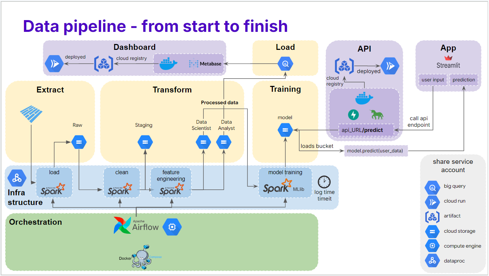

***This repository is currently work in progress***

------------------

*This repository is part of a larger project.*

# The Taxifare Optimization project

This project was completed as part of a Data Engineering Bootcamp at Le Wagon Paris and presented at Demo Day on November 8, 2024 ([View Project Demo Slides](https://docs.google.com/presentation/d/1KzT-0eyGO49xolFUZCZogSsWtMxqtQoaWvM5D2JieoY/edit?usp=sharing)).

The objective of this project was to build a complete ETL and machine learning pipeline—from data ingestion to an end-user interface—using tools covered in the bootcamp. Given a four-day timeframe, we leveraged previous bootcamp exercises as a foundation, enabling us to focus on optimizing and studying the performance of the pipeline.

Repositories that are part of the Taxifare Project:
- [**Taxifare**](https://github.com/Arivima/Le_Wagon_MLOps_Optimization_Taxifare):
A data engineering pipeline that ingests, processes, and stores NYC taxi ride data in cloud storage and a data warehouse.
  - Distributed processing with `Spark`, on `Dataproc`
  - Job orchestration using `Airflow`.
  - Cloud storage on `Google Cloud Storage`
  - Analytical warehouse with `BigQuery`
- [**Taxifare API**](https://github.com/Arivima/Le_Wagon_MLOps_Optimization_Taxifare_API):
A cloud-deployed API providing a prediction endpoint.
  - Built with `FastAPi` and `Gunicorn`
  - Deployed on `Google Cloud Run`, using a `Docker` image hosted in `Artifact Registery`
- [**Taxifare Front**](https://github.com/Arivima/Le_Wagon_MLOps_Optimization_Taxifare_Front):
A `Streamlit` application that allows users to predict taxi fares with our model.

*The project complete pipeline*

# Taxifare Optimization

Work in progress
